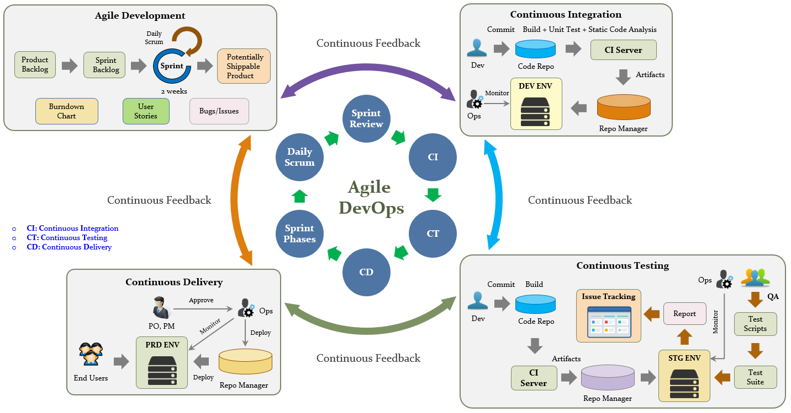
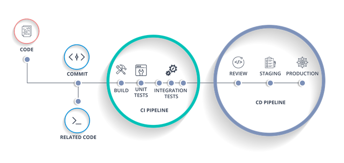
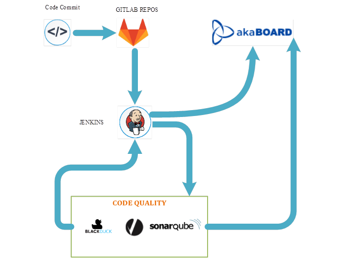

# Devops
## Why do we need DevOps?
Because traditional model(like Waterfalls) not suitable for projects that have continuous requirements changes, take time in development...We need to find out better solution:
- Increase deployment frequency
- Lower failure rate of new releases 
- Shortened lead time between fixes
- Faster mean time to recovery in the event of new release crashing
- Low cost for creating a product
## So, what DevOps really is?

- DevOps (a clipped compound of "development" and "operations") is a culture, movement or practice that emphasizes the collaboration and communication of both software developers and other information-technology (IT) professionals while automating the process of software delivery and infrastructure changes. (defined on [Wikipedia](https://en.wikipedia.org/wiki/DevOps))
- DevOps encompasses numerous activities and aspects, contains (C-A-L-M-S):
  + **Culture:** People over processes and tools. Promoting collaborative and open culture between Dev and Ops
  +	**Automation:** Automate wherever applicable for gaining quick feedback
  + **Learning:** Continuous learning & experimentation 
  +	**Measurement:** Measure with shared metrics across the Dev and ops for better management
  +	**Sharing:** Shared delivery process across Dev and Ops to build , deploy, maintain and monitor product with mentality of One Team – One Goal

### DevOps Practices
- CI/CD:
  + Continuous Integration: Continuous integration is a software development practice where developers regularly merge their code changes into a central repository, after which automated builds and tests are run. The key goals of continuous integration are to find and address bugs quicker, improve software quality, and reduce the time it takes to validate and release new software updates.
  + Continuous Delivery: Continuous delivery is a software development practice where code changes are automatically built, tested, and prepared for a release to production. It expands upon continuous integration by deploying all code changes to a testing environment and/or a production environment after the build stage. When continuous delivery is implemented properly, developers will always have a deployment-ready build artifact that has passed through a standardized test process.
- Microservices: A microservice is a type of software architecture. The modules in this software are divided into very small services (microservice). Each service will be located on a separate server -> easy to upgrade and scale the application.
- Infrastructure as Code: Set up / manage the system's previous stacks by defining them in a script file, for example instead of wasting time and effort setting up each manual (like configuration management, policy as code).
- Monitoring and Logging: See how application and infrastructure performance impacts the experience of their product’s end user. By capturing, categorizing, and then analyzing data and logs generated by applications and infrastructure, organizations understand how changes or updates impact users, shedding insights into the root causes of problems or unexpected changes.
- Communication and Collaboration: Helps speed up communication across developers, operations, and even other teams like marketing or sales, allowing all parts of the organization to align more closely on goals and projects.
## DevOps Toolchains
 Devops is intended to be a cross-functional mode of working, usingdifferent sets of tools—referred to as "toolchains", contains: 
- Coding – code development and review, source code management tools, code merging
- Building – continuous integration tools, build status
- Testing – continuous testing tools that provide quick and timely feedback on business risks
- Packaging – artifact repository, application pre-deployment staging
- Releasing – change management, release approvals, release automation
- Configuring – infrastructure configuration and management, infrastructure as code tools
- Monitoring – applications performance monitoring, end-user experience

 These tools can make development and operations workflows more streamlined and collaborative, automating previously time-consuming, manual, or static tasks involved in integration, development, testing, deployment, or monitoring.

## Agile & Devops Combination

## Devops in FSOFT
  - Just pause at CI/CD
  
  
  
## Resources
- https://aws.amazon.com/devops/what-is-devops/
- Devops document in FSOFT
- Devops for Developers by Michael Hüttermann
- https://github.com/AcalephStorage/awesome-devops
- https://martinfowler.com/bliki/DevOpsCulture.html
- http://www.jedi.be/blog/2010/02
- what-is-this-devops-thing-anyway/
- https://en.wikipedia.org/wiki/DevOps
- https://github.com/jakshi/devops-interview-questions
- https://github.com/XpiritBV/GDBC2018-Challenges
- https://github.com/DNXLabs/DevOps-Interview-Questions
- https://github.com/openshift-labs/devops-guides
- https://github.com/juliogomez/devops
- https://www.netapp.com/us/info/what-is-devops.aspx
