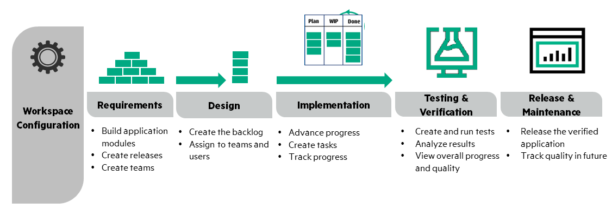

# Devops
## DevOps Definition
- The term DevOps is a blend of development (representing software developers, including programmers, testers, and quality assurance personnel) and operations (representing the experts who put software into production and manage the production infrastructure, including system administrators, database administrators, and network technicians). DevOps describes practices that streamline the software delivery process, emphasizing the learning by streaming feedback from production to development and improving the cycle time (i.e., the time from inception to delivery). DevOps will not only empower you to deliver software more quickly, but it will also help you to produce higher-quality software that is more aligned with individual requirements and basic conditions.
- DevOps encompasses numerous activities and aspects, such as the following:
  + **Culture:** People over processes and tools. Software is made by and for people.
  +	**Automation:** Automation is essential for DevOps to gain quick feedback.
  +	**Measurement:** DevOps finds a specific path to measurement. Quality and shared (or at least aligned) incentives are critical.
  +	**Sharing:** Creates a culture where people share ideas, processes, and tools.
### Devops Model
- DevOps is the combination of cultural philosophies, practices, and tools that increases an organization’s ability to deliver applications and services at high velocity: evolving and improving products at a faster pace than organizations using traditional software development and infrastructure management processes. This speed enables organizations to better serve their customers and compete more effectively in the market.

### Benefits of Devops
- Speed
- ...
### Compare to traditional software development flow
Compare vs Waterfalls model

### DevOps Practices
- CI/CD:
  + Continuous Integration:
  + Continuous Delivery:
- Microservices:
- Infrastructure as Code:
- Monitoring and Logging:
- Communication and Collaboration
## Devops in FSOFT
  
  
## References
- https://aws.amazon.com/devops/what-is-devops/
- Devops document in FSOFT
- Devops for Developers by Michael Hüttermann
- https://github.com/AcalephStorage/awesome-devops
- https://martinfowler.com/bliki/DevOpsCulture.html
- http://www.jedi.be/blog/2010/02/12/what-is-this-devops-thing-anyway/
- https://en.wikipedia.org/wiki/DevOps
